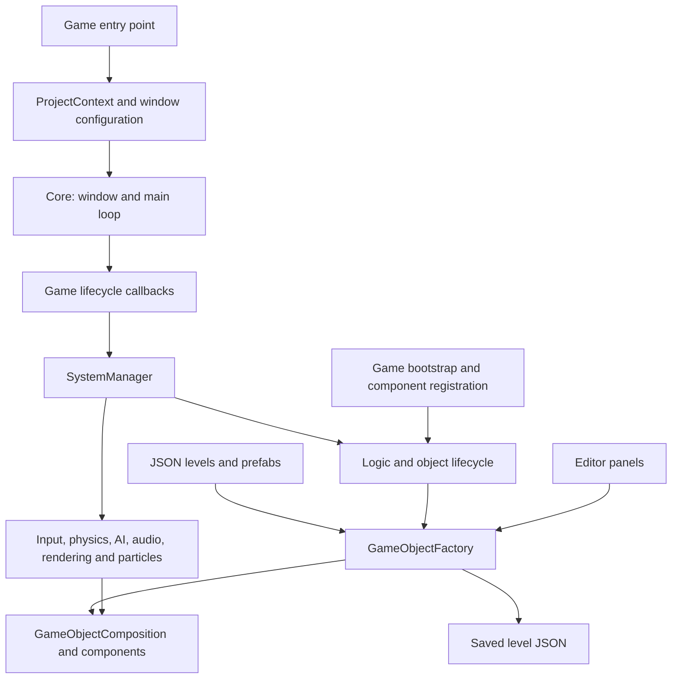

# Bloody Good Curry   Custom Game Engine

**Bloody Good Curry** s a 2D, top-down hack-and-slash game set in a sinister Singaporean HDB maisonette. Developed by **Team SofaSpuds**, the game runs on a custom C++20 engine created by the team, with component-based objects, JSON levels and prefabs, an integrated editor, and desktop and browser build support.

This repository contains the engine, the game, its assets, and a template for creating additional game projects.

## The game

You play as **Ming**, an aspiring curry rice hawker who sneaks into **Hei Bang's** home to steal the recipe behind his No. 1 curry store. Inside, Ming discovers the secret ingredient: human blood.

Explore the maisonette, fight enemies across its rooms, and uncover the story through lore items. Clearing a room unlocks its door and provides a checkpoint that restores health. Collect two keys to unlock the kitchen's secret room, then defeat the final boss.

Gameplay includes melee and ranged attacks, an enemy-slowing ability, enemies with different weaknesses, and room-based progression.

### Runtime controls

| Action | Keyboard / mouse | Controller |
| --- | --- | --- |
| Move | W / A / S / D | Left stick |
| Physical attack | Left mouse button | Right bumper (RB) |
| Ranged attack | Right mouse button | Left bumper (LB) |
| Slow enemies | F | B |
| Start / skip cutscene | Enter | |
| Pause / back / skip cutscene | Esc; Enter in some flows | |
| Toggle FPS display | P | |

Menu and cutscene actions depend on the current game state.

## Engine architecture

The engine builds as the `MyEngine` CMake library. The selected game builds as an executable linked against that library. `SOFASPUDS_GAME_NAME` selects both the game code and its content at configure time.



### Application and system lifecycle

[main.cpp](Sandbox/MyGame/main.cpp) resolves the active project, loads `Data/window.json`, creates `Core`, and registers the game's initialization, update, draw, shutdown, and focus callbacks.

[Core](Engine/Core/Core.hpp) owns the window and frame loop. Simulation uses a fixed 60 Hz timestep with a maximum of five substeps per frame. Native builds use a desktop loop; Emscripten builds hand frame scheduling to the browser. The game coordinates its menus and gameplay states through [Game.cpp](Sandbox/MyGame/Game.cpp), while [SystemManager](Engine/Systems/SystemManager.cpp) runs registered systems and records update and draw timings.

### Objects, components, and JSON

- **Composition:** [GameObjectComposition](Engine/Composition/Composition.h), also called `GOC`, holds an object's components, identity, name, and layer. It supports component lookup, messages, cloning, and lifecycle operations.
- **Factory:** [GameObjectFactory](Engine/Factory/Factory.h) registers component creators, owns live objects, assigns IDs, loads and saves levels, and defers object destruction.
- **Serialization and prefabs:** [Serialization](Engine/Serialization) reads JSON data, and [PrefabManager](Engine/Composition/PrefabManager.h) manages reusable object definitions. Levels and prefabs live in the active project's `Data` directory.
- **Memory:** [ObjectAllocator](Engine/Memory/ObjectAllocator.h), [GameObjectPool](Engine/Memory/GameObjectPool.h), and [ComponentPool](Engine/Memory/ComponentPool.h) provide pooled storage. Owning handles use custom deleters to return objects and components to their pools.

Engine components include transforms, sprites, animation, rigid bodies, audio, and rendering data. Bloody Good Curry adds player, enemy, attack, health, HUD, waypoint, and gate components. Its [GameBootstrap.cpp](Sandbox/MyGame/GameBootstrap.cpp) registers these types and their JSON handlers, configures level-load callbacks, and selects `level_RealTutorial.json` as the preferred startup level.

### Main subsystems

| Area | Responsibility | Source |
| --- | --- | --- |
| Graphics | OpenGL rendering, sprites, shapes, text, camera, viewport and picking | [Graphics](Engine/Graphics), [RenderSystem](Engine/Systems/RenderSystem.h) |
| Input | Keyboard, mouse and gamepad state | [Input](Engine/Input), [InputSystem](Engine/Systems/InputSystem.h) |
| Physics | 2D body movement, collision handling and spatial grid queries | [Physics](Engine/Physics), [PhysicSystem](Engine/Systems/PhysicSystem.h), [UniformGrid](Engine/Systems/UniformGrid.h) |
| Logic and AI | Object lifecycle, registered C++ behavior callbacks and AI support | [LogicSystem](Engine/Systems/LogicSystem.h), [AI](Engine/AI), [game AI](Sandbox/MyGame/AI) |
| Audio and video | Desktop FMOD audio, browser audio backend and MPEG video playback | [Audio](Engine/Audio), [Video](Engine/Video) |
| Resources | Asset discovery and resource loading | [Resource and asset managers](Engine/Resource_Asset_Manager) |
| Particles | Particle simulation, effects and game-defined presets | [ParticleSystem](Engine/Systems/ParticleSystem.h), [game presets](Sandbox/MyGame/ParticlePresets.cpp) |
| Editor and diagnostics | Level authoring, inspection, selection, undo, profiling and crash logging | [Debug](Engine/Debug) |
| Game runtime | Combat, health, gates, level transitions and camera zoom triggers | [Runtime](Sandbox/MyGame/Runtime) |

### Engine and game separation

[ProjectContext](Engine/Core/ProjectContext.h) and [PathUtils](Engine/Core/PathUtils.h) resolve the active project's `Assets`, `Data`, and `Saves` directories. Editor builds copy project-root metadata alongside the executable so tools can locate the source content. Desktop builds also copy runtime assets and data beside the executable; web builds package them into a virtual filesystem.

Game-specific setup enters through bootstrap callbacks, component registration, serialization handlers, and editor extensions. For example, the engine's [Spawn Panel](Engine/Debug/SpawnPanel.h) handles generic prefab placement and level saving, while Bloody Good Curry's [spawn extensions](Sandbox/MyGame/Editor/SpawnExtensions.cpp) add player, enemy, and gate settings.

The separation is still evolving: the engine target includes the selected game's headers, and some engine files retain game-specific references. Building a different project therefore recompiles the engine against that project's code.

## Repository layout

```text
Engine/                         Shared engine systems and editor tools
Sandbox/
  MyGame/                       Bloody Good Curry C++ code (legacy folder name)
  GameTemplate/                 Code template for generated projects
  NewGame/                      Example generated game
Games/
  BloodyGoodCurry/
    Assets/                     Art, audio, fonts and other source assets
    Data/                       Levels, prefabs, configuration and editor JSON
    Saves/                      Generated project save data
  NewGame/                      Example project's content
cmake/                          Dependency and build configuration helpers
app_resources/web/              Browser HTML shell
tools/                          Supporting utilities
CMakeLists.txt                  Engine/game selection and build options
CMakePresets.json               Desktop and Emscripten presets
```

Bloody Good Curry uses `Sandbox/MyGame` through an explicit CMake fallback. New projects use matching `Sandbox/<ProjectName>` and `Games/<ProjectName>` directories. Empty runtime directories may be created during configuration.

## Build and run on Windows

### Requirements

- Visual Studio 2022 with **Desktop development with C++** and the Windows SDK.
- CMake 3.20 or newer and Git available in the terminal.
- A graphics driver supporting OpenGL 3.3.
- Internet access for the first CMake configuration to fetch dependencies.

CMake fetches GLFW, GLM, stb_image, FreeType, pl_mpeg, and Dear ImGui when the editor is enabled. GLAD, JSON headers, and the Windows x64 FMOD libraries are included under `Engine/ThirdParty`. See [ImportDependencies.cmake](cmake/ImportDependencies.cmake) for the dependency revisions used by this repository.

Run the following commands in **PowerShell from the repository root**.

### Editor build

```powershell
.\run.bat BloodyGoodCurry
cmake --build build_BloodyGoodCurry_editor --config Debug --target BloodyGoodCurry --parallel
.\build_BloodyGoodCurry_editor\Sandbox\Debug\BloodyGoodCurry.exe
```

### Game build without the editor

```powershell
.\run_game.bat BloodyGoodCurry
cmake --build build_BloodyGoodCurry_game --config Release --target BloodyGoodCurry --parallel
.\build_BloodyGoodCurry_game\Sandbox\Release\BloodyGoodCurry.exe
```

**The batch scripts configure the Visual Studio solution only.** They pause when configuration finishes; press a key to return to the terminal, then run the build command. You can also open `giraphics.sln` in the corresponding build folder and build the `BloodyGoodCurry` startup project in Visual Studio.

Keep the generated `Assets`, `Data`, and `fmod.dll` beside the executable when moving a desktop build. Editor builds also use `sofaspuds_project_root.txt` to locate project content.

### CMake options

| Option | Default | Purpose |
| --- | --- | --- |
| `SOFASPUDS_GAME_NAME` | `BloodyGoodCurry` | Select the game code and content project |
| `SOFASPUDS_ENABLE_EDITOR` | `ON` | Compile the editor and ImGui tooling |
| `SOFASPUDS_DISABLE_AUDIO` | `OFF` | Disable native FMOD; native builds use stubs, while web builds use the browser backend |
| `SOFASPUDS_WEB_SINGLE_FILE` | Web release preset: `OFF` | Choose embedded output or separate web runtime and data files |

Emscripten forces the editor off and native FMOD off. Windows is the documented native build path; the supplied FMOD binaries target Windows x64.

## Browser build

Install and activate the Emscripten SDK, and make CMake, Git, Ninja, and Python 3 available. The helper can load the SDK environment from `%USERPROFILE%\emsdk\emsdk_env.bat`; otherwise, run it from a terminal where `EMSDK` is already configured.

```powershell
.\build_web_html.bat BloodyGoodCurry release-split reconfigure
```

This configures and builds the game, then starts a Python HTTP server. Open:

```text
http://localhost:8000/BloodyGoodCurry.html
```

The release output is under `build/web-release-split/Sandbox/` and contains HTML, JavaScript, WebAssembly, and a `.data` bundle. Assets and level data are mounted as `/Assets` and `/Data`. Serve the files over HTTP rather than opening the HTML directly from disk.

For a debug build, disable automatic serving and host the debug output explicitly. The helper's automatic server currently points to the release folder:

```powershell
.\build_web_html.bat BloodyGoodCurry debug reconfigure noserve
python -m http.server 8000 -d build\web-debug\Sandbox
```

The browser version uses WebGL2 and excludes the editor. [AudioManagerWeb.cpp](Engine/Audio/AudioManagerWeb.cpp) provides browser audio through the existing engine API; playback may need an initial click or keypress, and spatial audio is not implemented in this backend. The [HTML shell](app_resources/web/index_shell.html) handles loading feedback and disables the browser context menu for right-click attacks.

## Using the editor

Press **F10** in an editor build to toggle the panels. Browse assets in the Content Browser, spawn a prefab, select and edit the object, then save the level through the Spawn Panel. Newly spawned objects are selected automatically for immediate editing.

| Tool | Purpose |
| --- | --- |
| Hierarchy and Inspector | Find objects, select them and inspect component values |
| Content Browser | Browse and import project assets |
| JSON Editor | Edit the active project's JSON data |
| Properties Editor | Edit game-specific properties |
| Animation Editor | Configure sprite sheet animation |
| Layer Panel | Set the active layer and control layer visibility |
| Spawn Panel | Search prefabs, spawn objects, apply overrides, and save or load levels |
| Performance tools | Inspect frame and system timings |

| Shortcut | Action |
| --- | --- |
| F10 / F11 | Toggle editor panels / fullscreen |
| F1 | Performance window |
| F | Frame selection |
| T / R / S | Translate / rotate / scale gizmos |
| Delete / Ctrl+Z | Delete selection / undo |
| Middle mouse drag / mouse wheel | Pan / zoom editor camera |

F9 is an intentional crash-test shortcut. Further editor instructions are in [editorGuide.pdf](editorGuide.pdf).

### Creating another game

1. Choose **File > New Game** in the editor.
2. The editor creates `Games/<ProjectName>` for content and copies `Sandbox/GameTemplate` into `Sandbox/<ProjectName>` for code.
3. Build the new project with `.\run.bat <ProjectName>` or `.\run_game.bat <ProjectName>`, followed by `cmake --build` for its generated build folder.
4. Launch that project's executable. Creating a project does not switch the current session to its code.

The existing `NewGame` project includes `TestBox.json` and `TestGlowBox.json` under [its prefabs folder](Games/NewGame/Data/Prefabs). These demonstrate engine components and the template's `GlowComponent`. See [projectGuide.txt](projectGuide.txt) for the extended workflow.

## Elvis Lim Sheng Jie — Technical Lead contributions

Elvis's work focused on the engine foundation, editor workflows, gameplay support, and project portability. The areas below summarize the supplied personal contribution presentation and point to the corresponding implementation in this repository. They describe his contribution areas within the team project; shared systems also include teammates' work.

| Contribution | Implementation and purpose |
| --- | --- |
| Component architecture and object creation | [Composition](Engine/Composition), [Factory](Engine/Factory), and [Serialization](Engine/Serialization): component-based objects, JSON serialization and deserialization, prefab support, and cloning |
| Editor authoring tools | [Hierarchy](Engine/Debug/HierarchyPanel.cpp), [Inspector](Engine/Debug/Inspector.cpp), [JSON Editor](Engine/Debug/JsonEditorPanel.cpp), and [Spawn Panel](Engine/Debug/SpawnPanel.cpp): object management, property inspection, placement and level saving |
| Gameplay presentation and progression | [Player HUD](Sandbox/MyGame/UI/PlayerHUD.cpp), [health presentation](Sandbox/MyGame/HealthPresentation.cpp), and [GateController](Sandbox/MyGame/Runtime/GateController.cpp): health feedback and gate-based level transitions |
| Viewport and layer workflows | Contributions to [RenderSystem](Engine/Systems/RenderSystem.cpp), [LayerPanel](Engine/Debug/LayerPanel.cpp), and [Layer](Engine/Core/Layer.cpp) for editing and organizing scenes |
| Memory management | [Memory](Engine/Memory): custom allocator infrastructure and object/component pooling |
| Engine/game refactoring | [ProjectContext](Engine/Core/ProjectContext.cpp), [game bootstrap](Sandbox/MyGame/GameBootstrap.cpp), and [spawn extensions](Sandbox/MyGame/Editor/SpawnExtensions.cpp): project-specific paths, registration hooks and game-owned behavior |
| Web support | [CMake presets](CMakePresets.json), [web build helper](build_web_html.bat), and [browser audio backend](Engine/Audio/AudioManagerWeb.cpp), alongside contributions to the engine's Emscripten integration |
| Iteration through production use | Automatic selection of newly spawned objects in the [Spawn Panel](Engine/Debug/SpawnPanel.cpp), allowing immediate edits during level authoring |

## Team

| Member | Role |
| --- | --- |
| Elvis Lim | Technical Lead |
| Kong Yimo | Programmer / Designer |
| Erika Ishii | Programmer / Designer |
| Choo Jian Wei | Product Manager / Programmer |
| Ho Jun | Design Lead / Programmer |
| Chin Xin Jue | Artist Lead / Designer |
| Tay Wanxuan | Artist / Audio Lead |

## Further documentation

- [sofaspuds_ReadMe.txt](sofaspuds_ReadMe.txt): original game overview, controls and workflow notes.
- [projectGuide.txt](projectGuide.txt): project scaffolding, folder layout and prefab examples.
- [editorGuide.pdf](editorGuide.pdf): editor guide.
- [webFeatureGuide.txt](webFeatureGuide.txt): browser integration and troubleshooting.
- [WEB_DEPLOY_NETLIFY.md](WEB_DEPLOY_NETLIFY.md): web deployment workflow.

Some older notes describe the desktop helpers as build-and-run scripts or say web audio is disabled. The instructions above reflect the current scripts and audio backend.
